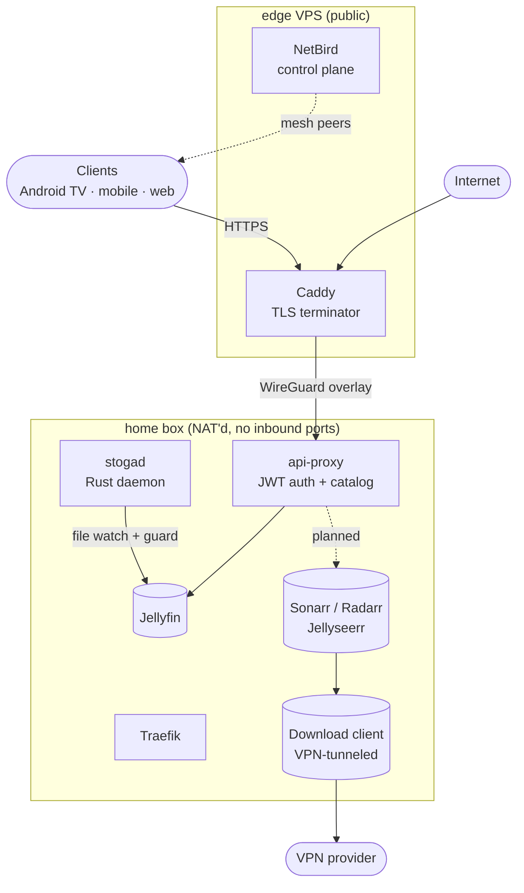

# Stoganet

Self-hosted media platform for a small private group. Jellyfin with a custom
API layer, native Android TV client, and fully automated download pipeline —
all running on a single home server with no open inbound ports.

## Repositories

| Repo | Role |
| --- | --- |
| [`api-proxy`](https://github.com/Stoganet/api-proxy) | Go HTTP/JSON API. Single backend for all clients — issues JWTs, proxies catalog and playback through Jellyfin, and aggregates Jellyseerr + \*arr behind one surface. Clients never talk directly to Jellyfin. |
| [`tv`](https://github.com/Stoganet/tv) | Native Android TV client. Kotlin + Compose-for-TV. Browse, detail, and Jellyfin playback handoff via `api-proxy`. |
| [`infra`](https://github.com/Stoganet/infra) | Home server: Docker Compose stack for Jellyfin, the \*arr automation suite, Jellyseerr, Traefik, and Portainer — deployed via GitHub Actions over a NetBird overlay. |
| [`edge`](https://github.com/Stoganet/edge) | Public-facing VPS: Caddy TLS terminator and a self-hosted NetBird control plane. Bridges the public internet to the home box over a private WireGuard mesh. |
| [`stogad`](https://github.com/Stoganet/stogad) | Native Rust daemon on the home server. File watcher and post-import guard for the media library (magic-byte validation, executable quarantine, junk cleanup). |

## Architecture

Two hosts, one mesh. The home box joins the NetBird overlay as a peer — no
port forwarding, no dynamic DNS. Caddy on the VPS reverse-proxies `api-proxy`
back across the tunnel. `api-proxy` is the only public endpoint; everything
else is reachable by NetBird peers only.

## Design principles

- **Minimal public surface.** Only `api-proxy` is exposed. Jellyfin and all admin tools are NetBird-only.
- **Clients never hold backend credentials.** `api-proxy` handles auth server-side and issues short-lived Jellyfin tokens for playback.
- **Wildcard TLS via DNS-01.** Single certificate covers all subdomains.
- **Hardened containers.** Memory limits, `no-new-privileges`, dropped capabilities, and healthchecks with restart policies throughout.
