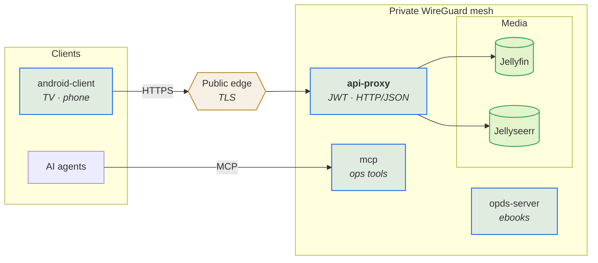

# Stoganet

Self-hosted, private media platform.

## Repositories

| Repo | Stack | Role |
| --- | --- | --- |
| [`api-proxy`](https://github.com/Stoganet/api-proxy) | Go | Single HTTP/JSON backend for all clients. Issues JWTs, proxies Jellyfin. |
| [`android-client`](https://github.com/Stoganet/android-client) | Kotlin, Compose | Android TV and phone apps. Talk only to `api-proxy`. |
| [`mcp`](https://github.com/Stoganet/mcp) | Go | MCP server exposing ops tools to AI agents. |
| [`opds-server`](https://github.com/Stoganet/opds-server) | Python | OPDS feed for ebook library. |

## Architecture

```mermaid
flowchart LR
  subgraph clients["Clients"]
    direction TB
    android["android-client<br/><i>TV · phone</i>"]
    agents["AI agents"]
  end

  edge{{"Public edge<br/><i>TLS</i>"}}

  subgraph mesh["Private WireGuard mesh"]
    direction LR
    api["<b>api-proxy</b><br/><i>JWT · HTTP/JSON</i>"]
    subgraph media["Media"]
      direction TB
      jf[("Jellyfin")]
      js[("Jellyseerr")]
    end
    mcp["mcp<br/><i>ops tools</i>"]
    opds["opds-server<br/><i>ebooks</i>"]
    api --> jf
    api --> js
  end

  android -->|HTTPS| edge
  agents -->|MCP| mcp
  edge --> api

  classDef repo fill:#1f6feb22,stroke:#1f6feb,stroke-width:1.5px;
  classDef store fill:#2da44e22,stroke:#2da44e,stroke-width:1.5px;
  classDef gate fill:#bf873022,stroke:#bf8730,stroke-width:1.5px;
  class android,api,mcp,opds repo;
  class jf,js store;
  class edge gate;
```
